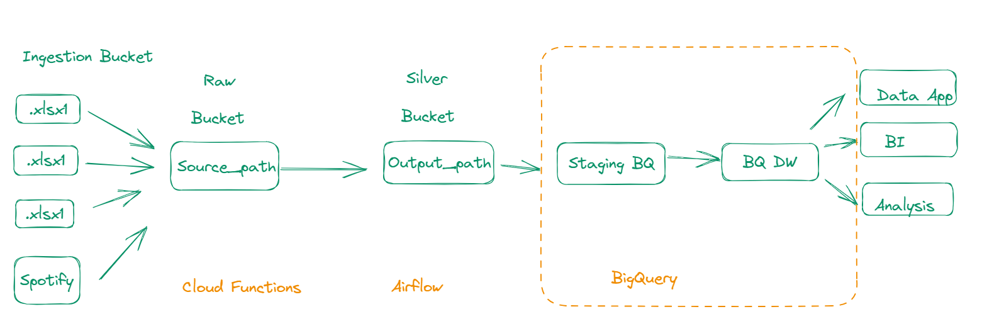

# Cloud data lake on GCP

Links

https://developer.spotify.com/
https://www.geeksforgeeks.org/python-program-convert-string-list/
https://github.com/tuanchris/cloud-data-lake#gcp-setup
https://confluence.atlassian.com/bitbucketserver/basic-git-commands-776639767.html
https://www.programiz.com/python-programming/recursion
